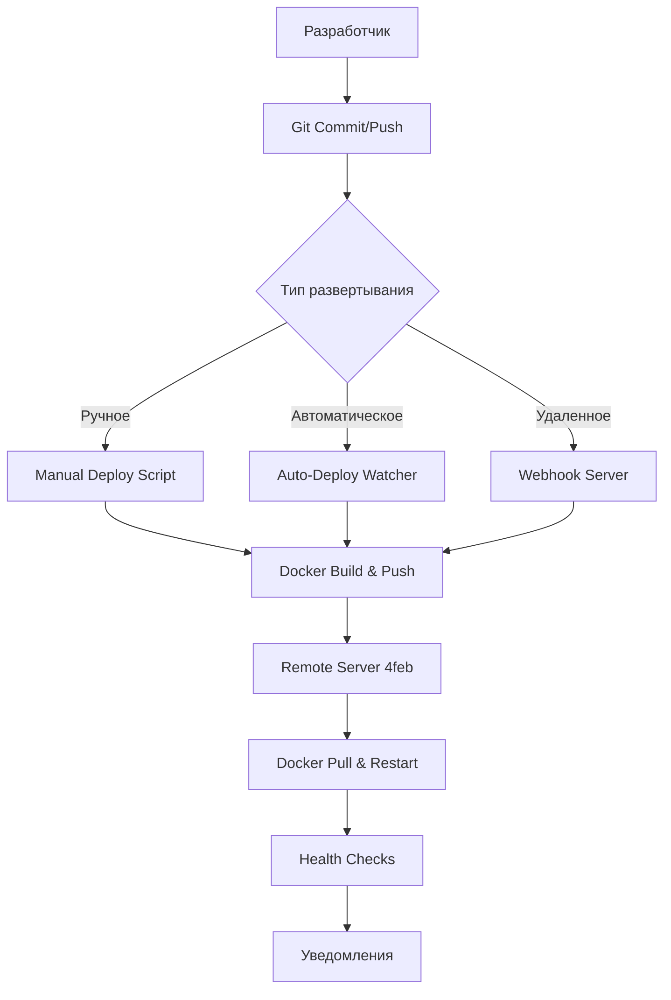

# 🚀 LysoData-Miner CI/CD System

Простая и эффективная система непрерывной интеграции и развертывания для LysoData-Miner без использования GitHub Actions.

## 📋 Обзор системы

Система CI/CD состоит из трех основных компонентов:

1. **🚀 Manual Deploy Script** - Ручное развертывание с интеллектуальным определением изменений
2. **👁️ Auto-Deploy Watcher** - Автоматическое отслеживание изменений в git и развертывание
3. **🔗 Webhook Server** - HTTP endpoint для удаленного триггера развертывания

## 🏗️ Архитектура



## 🚀 Быстрый старт

### 1. Настройка системы

```bash
# Настройка CI/CD
make -f Makefile.cicd cicd-setup

# Проверка статуса
make -f Makefile.cicd cicd-status
```

### 2. Ручное развертывание

```bash
# Полное развертывание
make -f Makefile.cicd deploy

# Только frontend
make -f Makefile.cicd deploy-frontend

# Только backend  
make -f Makefile.cicd deploy-backend

# Предварительный просмотр (dry run)
make -f Makefile.cicd deploy-dry-run
```

### 3. Автоматическое развертывание

```bash
# Запуск watcher'а
make -f Makefile.cicd watch-start

# Проверка статуса
make -f Makefile.cicd watch-status

# Просмотр логов
make -f Makefile.cicd watch-logs

# Остановка
make -f Makefile.cicd watch-stop
```

### 4. Webhook сервер

```bash
# Запуск webhook сервера
make -f Makefile.cicd webhook-start-bg

# Тестирование
make -f Makefile.cicd webhook-test

# Остановка
make -f Makefile.cicd webhook-stop
```

## 📁 Файловая структура

```
lysobacters/
├── scripts/
│   ├── deploy_to_4feb.sh      # Основной скрипт развертывания
│   ├── watch_and_deploy.sh    # Watcher для автоматического развертывания
│   └── webhook_server.py      # HTTP сервер для webhook'ов
├── Makefile.cicd              # Команды управления CI/CD
├── CI_CD_GUIDE.md            # Эта документация
└── .last_deploy_*            # Файлы отслеживания последних развертываний
```

## 🔧 Компоненты системы

### 1. Manual Deploy Script (`scripts/deploy_to_4feb.sh`)

**Возможности:**
- ✅ Интеллектуальное определение изменений через git diff
- ✅ Сборка и push Docker образов в Docker Hub
- ✅ Автоматическое создание backup'ов перед развертыванием
- ✅ Health checks после развертывания
- ✅ Поддержка различных опций развертывания

**Опции:**
```bash
--force-build         # Принудительная пересборка
--skip-tests          # Пропуск тестов
--no-backup           # Без backup'а
--frontend-only       # Только frontend
--backend-only        # Только backend
--dry-run             # Предварительный просмотр
```

**Пример использования:**
```bash
# Полное развертывание
./scripts/deploy_to_4feb.sh

# Принудительная пересборка
./scripts/deploy_to_4feb.sh --force-build

# Только frontend без тестов
./scripts/deploy_to_4feb.sh --frontend-only --skip-tests
```

### 2. Auto-Deploy Watcher (`scripts/watch_and_deploy.sh`)

**Возможности:**
- ✅ Мониторинг git репозитория на изменения
- ✅ Автоматический pull и развертывание
- ✅ Настраиваемый интервал проверки
- ✅ Логирование всех операций
- ✅ Desktop уведомления
- ✅ Поддержка webhook уведомлений

**Команды:**
```bash
# Запуск
./scripts/watch_and_deploy.sh start

# Запуск с настройками
./scripts/watch_and_deploy.sh start --interval 60 --auto-commit

# Статус
./scripts/watch_and_deploy.sh status

# Логи
./scripts/watch_and_deploy.sh logs

# Остановка
./scripts/watch_and_deploy.sh stop
```

**Конфигурация:**
```bash
WATCH_INTERVAL=30          # Интервал проверки (секунды)
WATCH_BRANCH="main"        # Отслеживаемая ветка
AUTO_COMMIT=false          # Автоматический commit
NOTIFICATION_WEBHOOK=""    # URL для уведомлений
```

### 3. Webhook Server (`scripts/webhook_server.py`)

**Возможности:**
- ✅ HTTP API для удаленного триггера развертывания
- ✅ Поддержка подписей для безопасности
- ✅ Ограничение по IP адресам
- ✅ Логирование всех запросов
- ✅ Асинхронное выполнение развертывания

**Endpoints:**
```
GET  /              # Информация о сервере
GET  /health        # Health check
GET  /status        # Статус развертывания
POST /deploy        # Триггер развертывания
```

**Конфигурация через переменные окружения:**
```bash
WEBHOOK_PORT=9000                           # Порт сервера
WEBHOOK_SECRET="lysodata-webhook-secret"    # Секрет для подписей
DEPLOY_SCRIPT="./scripts/deploy_to_4feb.sh" # Скрипт развертывания
ALLOWED_IPS="192.168.1.100,10.0.0.50"     # Разрешенные IP
```

**Примеры запросов:**
```bash
# Простое развертывание
curl -X POST http://localhost:9000/deploy

# С опциями
curl -X POST http://localhost:9000/deploy \
     -H "Content-Type: application/json" \
     -d '{"options": {"force_build": true, "skip_tests": true}}'

# С подписью
curl -X POST http://localhost:9000/deploy \
     -H "X-Hub-Signature-256: sha256=<signature>" \
     -d '{"options": {"frontend_only": true}}'
```

## 📊 Мониторинг и логирование

### Логи системы

```bash
# Логи auto-deploy watcher
tail -f auto_deploy.log

# Логи webhook сервера
tail -f webhook_deploy.log

# Логи развертывания
# (выводятся в консоль или перенаправляются в файлы)
```

### Статус системы

```bash
# Полный статус CI/CD
make -f Makefile.cicd cicd-status

# Статус watcher'а
make -f Makefile.cicd watch-status

# Статус webhook сервера
make -f Makefile.cicd webhook-status
```

## 🔄 Workflow развертывания

### Автоматический workflow

1. **Изменения в коде** → git commit/push
2. **Watcher обнаруживает изменения** → git pull
3. **Анализ изменений** → определение компонентов для обновления
4. **Сборка образов** → docker build + push в Docker Hub
5. **Backup на сервере** → создание backup'а БД
6. **Развертывание** → docker pull + restart на сервере 4feb
7. **Health checks** → проверка работоспособности
8. **Уведомления** → отправка статуса

### Ручной workflow

1. **Разработчик запускает** → `make -f Makefile.cicd deploy`
2. **Проверка изменений** → git diff анализ
3. **Опциональные тесты** → pytest + npm test
4. **Сборка и push** → только измененных компонентов
5. **Развертывание** → автоматическое обновление на сервере
6. **Результат** → статус и ссылки на приложение

## 🛡️ Безопасность

### Webhook безопасность

```bash
# Настройка секрета
export WEBHOOK_SECRET="your-secure-secret-here"

# Ограничение IP адресов
export ALLOWED_IPS="192.168.1.100,10.0.0.50"

# Генерация подписи (пример на Python)
import hmac
import hashlib

secret = "your-secret"
payload = '{"options": {"force_build": true}}'
signature = hmac.new(
    secret.encode('utf-8'),
    payload.encode('utf-8'),
    hashlib.sha256
).hexdigest()
print(f"X-Hub-Signature-256: sha256={signature}")
```

### SSH ключи

Убедитесь, что настроены SSH ключи для подключения к серверу 4feb:

```bash
# Проверка подключения
ssh 4feb "echo 'Connection OK'"

# Настройка SSH config (~/.ssh/config)
Host 4feb
    HostName 89.169.171.236
    User your_username
    IdentityFile ~/.ssh/your_key
```

## 🚨 Устранение неполадок

### Проблемы с развертыванием

```bash
# Проверка логов развертывания
make -f Makefile.cicd deploy-dry-run

# Проверка Docker Hub аутентификации
docker login

# Проверка подключения к серверу
ssh 4feb "docker ps"

# Проверка health checks
ssh 4feb "curl -sf http://localhost:8000/api/health/"
```

### Проблемы с watcher'ом

```bash
# Проверка статуса
make -f Makefile.cicd watch-status

# Просмотр логов
make -f Makefile.cicd watch-logs

# Перезапуск
make -f Makefile.cicd watch-stop
make -f Makefile.cicd watch-start
```

### Проблемы с webhook'ом

```bash
# Проверка статуса
make -f Makefile.cicd webhook-status

# Тестирование endpoint'а
make -f Makefile.cicd webhook-test

# Просмотр логов
make -f Makefile.cicd webhook-logs
```

## 📈 Расширение системы

### Добавление уведомлений

```bash
# Slack webhook
export NOTIFICATION_WEBHOOK="https://hooks.slack.com/services/YOUR/SLACK/WEBHOOK"

# Discord webhook
export NOTIFICATION_WEBHOOK="https://discord.com/api/webhooks/YOUR/DISCORD/WEBHOOK"

# Telegram bot
# Можно расширить скрипты для поддержки Telegram API
```

### Интеграция с Git хуками

```bash
# Pre-commit хук для автоматических тестов
#!/bin/bash
# .git/hooks/pre-commit
make -f Makefile.cicd test-deploy
```

### Мониторинг производительности

```bash
# Добавление метрик времени развертывания
# Интеграция с Prometheus/Grafana
# Логирование времени выполнения каждого этапа
```

## 🎯 Лучшие практики

1. **Тестирование перед развертыванием**
   ```bash
   make -f Makefile.cicd deploy-dry-run
   ```

2. **Создание backup'ов**
   ```bash
   # Всегда включено по умолчанию
   # Отключить только с --no-backup при необходимости
   ```

3. **Мониторинг логов**
   ```bash
   # Регулярная проверка логов
   make -f Makefile.cicd watch-logs
   ```

4. **Health checks**
   ```bash
   # Проверка статуса после развертывания
   make -f Makefile.cicd cicd-status
   ```

5. **Безопасность**
   ```bash
   # Использование секретов для webhook'ов
   # Ограничение IP адресов
   # Регулярное обновление SSH ключей
   ```

## 📞 Поддержка

При возникновении проблем:

1. **Проверьте статус системы**: `make -f Makefile.cicd cicd-status`
2. **Просмотрите логи**: `make -f Makefile.cicd watch-logs`
3. **Протестируйте компоненты**: `make -f Makefile.cicd webhook-test`
4. **Проверьте подключение к серверу**: `ssh 4feb "docker ps"`

---

**🎉 Система CI/CD готова к использованию!**

Теперь вы можете автоматически развертывать LysoData-Miner на сервер 4feb простыми командами или полностью автоматически при изменениях в коде. 