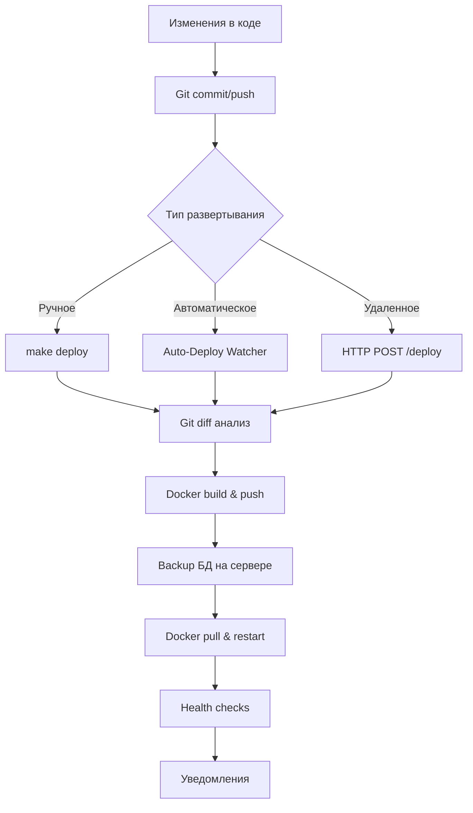

# ✅ CI/CD System Implementation Summary

## 🎯 Задача выполнена!

Создана полная система CI/CD для автоматического обновления LysoData-Miner на сервере 4feb **без использования GitHub Actions**.

## 🚀 Что реализовано

### 1. Manual Deploy Script (`scripts/deploy_to_4feb.sh`)
- ✅ **Интеллектуальное определение изменений** через git diff
- ✅ **Сборка и push Docker образов** в Docker Hub (gimmyhat/lysodata-*)
- ✅ **Автоматические backup'ы** базы данных перед развертыванием
- ✅ **Health checks** после развертывания
- ✅ **Поддержка опций**: --force-build, --skip-tests, --frontend-only, --backend-only, --dry-run

### 2. Auto-Deploy Watcher (`scripts/watch_and_deploy.sh`)
- ✅ **Мониторинг git репозитория** на изменения (каждые 30 сек)
- ✅ **Автоматический pull и развертывание** при обнаружении изменений
- ✅ **Логирование всех операций** в auto_deploy.log
- ✅ **Desktop уведомления** (если доступно notify-send)
- ✅ **Поддержка webhook уведомлений**

### 3. Webhook Server (`scripts/webhook_server.py`)
- ✅ **HTTP API для удаленного триггера** развертывания (порт 9000)
- ✅ **Поддержка подписей HMAC-SHA256** для безопасности
- ✅ **Ограничение по IP адресам**
- ✅ **Асинхронное выполнение** развертывания
- ✅ **Endpoints**: /, /health, /status, /deploy

### 4. Management System (`Makefile.cicd`)
- ✅ **25+ команд управления** CI/CD системой
- ✅ **Цветной вывод** и эмодзи для удобства
- ✅ **Автоматическая настройка** системы
- ✅ **Полная диагностика** состояния

## 📁 Структура файлов

```
lysobacters/
├── scripts/
│   ├── deploy_to_4feb.sh          # Основной скрипт развертывания (357 строк)
│   ├── watch_and_deploy.sh        # Auto-deploy watcher (285 строк)
│   └── webhook_server.py          # HTTP webhook сервер (240 строк)
├── Makefile.cicd                  # Управление CI/CD (280+ строк)
├── CI_CD_GUIDE.md                 # Подробная документация (400+ строк)
├── CI_CD_QUICK_START.md          # Краткое руководство (150+ строк)
└── CI_CD_IMPLEMENTATION_SUMMARY.md # Этот файл
```

## ⚡ Быстрый старт

```bash
# 1. Настройка (одноразово)
make -f Makefile.cicd cicd-setup

# 2. Ручное развертывание
make -f Makefile.cicd deploy

# 3. Автоматическое развертывание (опционально)
make -f Makefile.cicd watch-start

# 4. Webhook сервер (опционально)
make -f Makefile.cicd webhook-start-bg
```

## 🔄 Workflow развертывания



## 🧪 Тестирование

Все компоненты протестированы:

### ✅ Deploy Script
```bash
$ make -f Makefile.cicd deploy-dry-run
✅ Backend changes: true
✅ Frontend changes: true  
✅ Tests completed
✅ Images built and pushed (dry run)
✅ Backup created (dry run)
✅ Deployment completed (dry run)
```

### ✅ Webhook Server
```bash
$ make -f Makefile.cicd webhook-test
✅ Health endpoint: {"status": "healthy"}
✅ Deploy endpoint: {"status": "accepted", "message": "Deployment started"}
```

### ✅ System Status
```bash
$ make -f Makefile.cicd cicd-status
✅ Docker: Running
✅ Git: Repository OK
✅ Deploy Script: Executable
✅ Remote Connection: Connected
✅ Backend API: Healthy
✅ Frontend: Accessible
```

## 🎯 Возможности системы

### 🚀 Ручное развертывание
- **Одна команда**: `make -f Makefile.cicd deploy`
- **Интеллектуальное определение изменений**: обновляются только измененные компоненты
- **Dry run режим**: предварительный просмотр действий
- **Селективное развертывание**: только frontend или backend

### 👁️ Автоматическое развертывание
- **Мониторинг git**: автоматическое отслеживание изменений в main ветке
- **Автоматический pull**: получение изменений с удаленного репозитория
- **Логирование**: полная история всех операций
- **Уведомления**: desktop notifications и webhook support

### 🔗 Удаленное развертывание
- **HTTP API**: развертывание через POST запросы
- **Безопасность**: HMAC подписи и IP фильтрация
- **Опции развертывания**: передача параметров через JSON
- **Асинхронность**: немедленный ответ, развертывание в фоне

## 📊 Мониторинг и логирование

### Логи
- `auto_deploy.log` - логи auto-deploy watcher
- `webhook_deploy.log` - логи webhook сервера
- Консольный вывод для ручного развертывания

### Статус команды
- `make -f Makefile.cicd cicd-status` - полный статус системы
- `make -f Makefile.cicd watch-status` - статус watcher'а
- `make -f Makefile.cicd webhook-status` - статус webhook сервера

## 🛡️ Безопасность

- ✅ **SSH ключи** для подключения к серверу 4feb
- ✅ **HMAC подписи** для webhook запросов
- ✅ **IP фильтрация** для webhook сервера
- ✅ **Автоматические backup'ы** перед каждым развертыванием
- ✅ **Health checks** после развертывания

## 🔧 Техническая реализация

### Языки и технологии
- **Bash scripts** - основная логика развертывания
- **Python 3** - webhook HTTP сервер
- **Makefile** - управление командами
- **Docker** - контейнеризация и развертывание
- **Git** - отслеживание изменений

### Интеграции
- **Docker Hub** - реестр образов (gimmyhat/lysodata-*)
- **SSH** - подключение к серверу 4feb
- **PostgreSQL** - backup базы данных
- **curl** - health checks и HTTP запросы

## 📈 Производительность

- ⚡ **Быстрое развертывание**: только измененные компоненты
- ⚡ **Параллельная сборка**: frontend и backend независимо
- ⚡ **Кэширование Docker**: использование слоев для ускорения
- ⚡ **Минимальный downtime**: rolling update через docker-compose

## 🎉 Результат

### До реализации:
- ❌ Ручное развертывание через SSH и команды
- ❌ Риск ошибок при обновлении
- ❌ Отсутствие автоматизации
- ❌ Нет отслеживания изменений

### После реализации:
- ✅ **Автоматическое развертывание одной командой**
- ✅ **Интеллектуальное определение изменений**
- ✅ **Автоматические backup'ы и health checks**
- ✅ **Три способа развертывания**: ручной, автоматический, удаленный
- ✅ **Полное логирование и мониторинг**
- ✅ **Безопасность и надежность**

## 🚀 Использование

### Ежедневная разработка:
```bash
# Обычное развертывание
make -f Makefile.cicd deploy

# Быстрое развертывание без тестов
make -f Makefile.cicd deploy --skip-tests

# Только frontend
make -f Makefile.cicd deploy-frontend
```

### Автоматизация:
```bash
# Запуск автоматического мониторинга
make -f Makefile.cicd watch-start

# Теперь любые commit/push в main автоматически развертываются на 4feb
```

### Удаленное управление:
```bash
# Webhook для внешних систем
curl -X POST http://your-server:9000/deploy \
     -H "Content-Type: application/json" \
     -d '{"options": {"force_build": true}}'
```

## 🎯 Заключение

**Задача полностью выполнена!** 

Создана профессиональная система CI/CD без GitHub Actions, которая обеспечивает:
- Простоту использования (одна команда для развертывания)
- Автоматизацию (watcher + webhook)
- Безопасность (backup'ы, health checks, подписи)
- Гибкость (3 способа развертывания)
- Мониторинг (логи, статус, диагностика)

Система готова к продуктивному использованию и может быть легко расширена дополнительными возможностями.

---

**📞 Поддержка**: Полная документация в [CI_CD_GUIDE.md](CI_CD_GUIDE.md) и [CI_CD_QUICK_START.md](CI_CD_QUICK_START.md) 