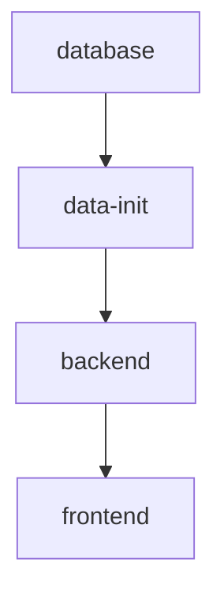

# 🧬 LysoData-Miner Production Deployment

Этот документ описывает production deployment системы **LysoData-Miner** с использованием Docker Compose.

## 🏗️ Архитектура

Система состоит из **четырех сервисов**:

1. **🗄️ Database** (`lysodata_db`) - PostgreSQL 15 с полной схемой данных
2. **🚀 Backend** (`lysodata_api`) - FastAPI приложение для API
3. **⚛️ Frontend** (`lysodata_web`) - React приложение с Nginx
4. **📊 Data Init** (`lysodata_init`) - Одноразовый сервис инициализации данных

### ⚡ Зависимости запуска



- **Backend** ждет завершения инициализации данных и health check базы
- **Frontend** ждет health check backend
- **Бэкапы** хранятся на хост-машине в `./backups/`

---

## 🚀 Быстрый старт

### 1. Подготовка

```bash
# Клонируйте репозиторий
git clone <repository-url>
cd lysobacters

# Создайте конфигурацию (автоматически при первом запуске)
cp env.production.example .env.production

# Отредактируйте пароли в .env.production
nano .env.production
```

### 2. Запуск

```bash
# Запуск всей системы одной командой
make -f Makefile.production prod-up

# Или короче, если нет конфликтов с основным Makefile
make prod-up
```

### 3. Проверка

```bash
# Проверка статуса всех сервисов
make prod-status

# Просмотр логов инициализации
make prod-logs-init

# Просмотр всех логов
make prod-logs
```

### 4. Доступ к приложению

- **🌐 Frontend**: http://localhost:3000
- **🔌 Backend API**: http://localhost:8000
- **📚 API Docs**: http://localhost:8000/docs
- **🗄️ Database**: localhost:5434

---

## 📋 Полная справка команд

### 🎯 Основные команды

```bash
make prod-up           # 🚀 Запуск всех сервисов
make prod-down         # 🛑 Остановка всех сервисов  
make prod-restart      # 🔄 Перезапуск всех сервисов
make prod-status       # 📊 Статус и health checks
make prod-logs         # 📋 Просмотр логов
```

### 🔧 Управление сервисами

```bash
make prod-build        # 🏗️ Пересборка Docker образов
make prod-clean        # 🧹 Очистка Docker ресурсов
make prod-reset        # 🔄 Полный сброс и пересборка
```

### 📊 Мониторинг и диагностика

```bash
make prod-stats        # 📊 Статистика базы данных
make prod-logs-backend # 📋 Логи только backend
make prod-logs-frontend # 📋 Логи только frontend
make prod-logs-init    # 📋 Логи инициализации данных
```

### 💾 Backup и восстановление

```bash
make prod-backup       # 💾 Создание backup базы данных
make prod-restore BACKUP_FILE=./backups/backup_20250629_120000.sql.gz
```

### 💻 Доступ к контейнерам

```bash
make prod-shell-db     # 💻 PostgreSQL shell
make prod-shell-backend # 💻 Backend container shell
make prod-shell-frontend # 💻 Frontend container shell
```

---

## ⚙️ Конфигурация

### Переменные окружения (`.env.production`)

```bash
# 🗄️ Database Settings
POSTGRES_DB=lysobacter_db
POSTGRES_USER=lysobacter_user
POSTGRES_PASSWORD=your_secure_password_here
DB_PORT=5434

# 🌐 Web Settings  
WEB_PORT=3000

# 🚀 Application Settings
APP_ENV=production
DEBUG=false
```

### 📂 Структура volumes

```bash
# Persistent data
postgres_data/           # База данных PostgreSQL

# Host-mounted directories
./backups/              # Бэкапы базы данных (на хосте)
./database/schema/      # SQL схема для инициализации
./database/examples/    # Примеры данных
./database/data/        # JSON данные для импорта
./scripts/             # Скрипты импорта данных
```

---

## 🔄 Процесс инициализации

При первом запуске система автоматически:

1. **🗄️ Создает базу данных** PostgreSQL
2. **📋 Выполняет SQL миграции**:
   - `01_create_tables.sql` - создание таблиц
   - `02_insert_reference_data.sql` - справочные данные
   - `03_views_and_functions.sql` - представления и функции
   - `04-07_*.sql` - миграции для новых возможностей
3. **📊 Загружает примеры данных** из `sample_data.sql`
4. **📥 Импортирует JSON данные** если есть файлы в `database/data/`
5. **📊 Выводит статистику** загруженных данных

### Результат инициализации

После успешной инициализации в базе будут:

- **212+ штаммов** Lysobacter
- **6 категорий тестов**
- **78+ различных тестов**
- **1,397+ булевых результатов**
- **511+ числовых результатов**

---

## 🏥 Health Checks и мониторинг

### Автоматические проверки

Каждый сервис имеет встроенные health checks:

- **Database**: `pg_isready` каждые 15 секунд
- **Backend**: HTTP проверка `/api/health/` каждые 30 секунд  
- **Frontend**: HTTP проверка главной страницы каждые 30 секунд

### Мониторинг команды

```bash
# Полная проверка здоровья
make prod-status

# Проверка конкретного сервиса
curl http://localhost:8000/api/health/
curl http://localhost:3000/

# Проверка базы данных
docker exec lysodata_db pg_isready -U lysobacter_user
```

---

## 🚨 Troubleshooting

### Частые проблемы

#### 🔧 Сервисы не запускаются

```bash
# Проверьте логи
make prod-logs

# Проверьте Docker ресурсы
docker system df
docker system prune  # Если мало места

# Пересоберите образы
make prod-build
```

#### 🗄️ Проблемы с базой данных

```bash
# Проверьте инициализацию
make prod-logs-init

# Подключитесь к базе
make prod-shell-db

# Проверьте таблицы
\dt lysobacter.*
```

#### 🌐 Frontend не доступен

```bash
# Проверьте статус nginx
make prod-logs-frontend

# Проверьте проксирование API
curl http://localhost:3000/api/health/
```

#### 💾 Проблемы с бэкапами

```bash
# Проверьте права доступа
ls -la ./backups/

# Создайте директорию если нужно
mkdir -p ./backups
chmod 755 ./backups
```

### Восстановление после сбоя

```bash
# Полная пересборка
make prod-reset

# Восстановление из бэкапа
make prod-backup  # Сначала создайте текущий backup
make prod-restore BACKUP_FILE=./backups/backup_20250629_120000.sql.gz
```

---

## 📊 Production Best Practices

### 🔒 Безопасность

1. **Измените пароли** в `.env.production`
2. **Ограничьте доступ** к портам через firewall
3. **Используйте HTTPS** с reverse proxy (nginx/traefik)
4. **Настройте регулярные backup**

### 🚀 Производительность

1. **Мониторьте ресурсы** контейнеров
2. **Настройте логирование** с ротацией
3. **Используйте объемы** для persistent данных
4. **Рассмотрите масштабирование** при высокой нагрузке

### 💾 Backup стратегия

```bash
# Ежедневные автоматические backup
# Добавьте в cron:
0 2 * * * cd /path/to/lysobacters && make prod-backup

# Еженедельные полные backup с архивированием
0 1 * * 0 cd /path/to/lysobacters && make prod-backup && tar -czf backup_weekly_$(date +%Y%m%d).tar.gz ./backups/
```

---

## 🎯 Следующие шаги

1. **Настройте reverse proxy** (nginx/traefik) для SSL
2. **Добавьте мониторинг** (Prometheus/Grafana)
3. **Настройте CI/CD** для автоматического deployment
4. **Рассмотрите кластерное развертывание** для high availability

---

## 📞 Поддержка

При возникновении проблем:

1. **Проверьте логи**: `make prod-logs`
2. **Проверьте статус**: `make prod-status` 
3. **Создайте issue** с полными логами и описанием проблемы
4. **Используйте команды диагностики** из этого документа 