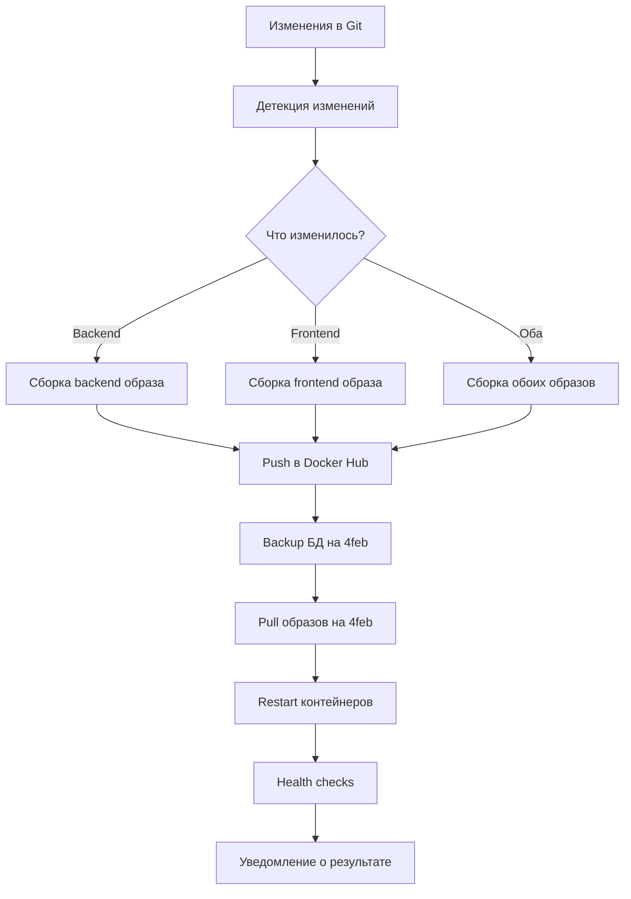

# Technical Context - LysoData-Miner

## Технологический стек

### Backend
- **FastAPI** - современный async веб-фреймворк для Python
- **SQLAlchemy** (async) - ORM для работы с PostgreSQL
- **Pydantic** - валидация данных и сериализация
- **Uvicorn** - ASGI сервер для production
- **psycopg2-binary** - PostgreSQL драйвер

### Frontend
- **React 18** - основная библиотека UI
- **TypeScript** - типизированный JavaScript
- **Vite** - быстрый build tool и dev server
- **Tailwind CSS** - utility-first CSS фреймворк
- **React Hook Form** - управление формами
- **Zod** - валидация схем TypeScript
- **React Router** - клиентский роутинг

### База данных
- **PostgreSQL 12+** - основная СУБД
- **Нормализованная схема (3NF)** - 24 таблицы
- **Индексы** - оптимизация для поиска и аналитики
- **Функции и представления** - бизнес-логика на уровне БД

### Развертывание и CI/CD
- **Docker** - контейнеризация приложений
- **Docker Hub** - публичный registry (gimmyhat/lysodata-*)
- **SSH** - безопасное подключение к production серверу
- **Bash scripts** - автоматизация развертывания
- **Python scripts** - webhook сервер
- **Makefile** - управление командами

## Архитектура системы

### Структура проекта (после реорганизации)
```
lysobacters/
├── backend/                     # FastAPI приложение
│   ├── app/
│   │   ├── api/                # REST API эндпоинты
│   │   │   ├── strains.py      # CRUD штаммов
│   │   │   ├── tests.py        # Управление тестами
│   │   │   ├── identification.py # Алгоритм идентификации
│   │   │   ├── stats.py        # Статистика
│   │   │   └── health.py       # Health checks
│   │   ├── models/             # SQLAlchemy модели
│   │   │   ├── strain.py       # Модель штамма
│   │   │   ├── test.py         # Модель теста
│   │   │   ├── result.py       # Результаты тестов
│   │   │   └── audit.py        # Аудит изменений
│   │   ├── core/
│   │   │   └── config.py       # Конфигурация приложения
│   │   └── database/
│   │       └── connection.py   # Подключение к БД
│   ├── database/               # Схема БД и скрипты
│   └── Dockerfile              # Multi-stage build
│
├── frontend/                    # React SPA
│   ├── src/
│   │   ├── components/         # Переиспользуемые компоненты
│   │   │   ├── IdentificationForm.tsx
│   │   │   ├── StrainCard.tsx
│   │   │   ├── ComparisonTable.tsx
│   │   │   └── SpeciesDetail.tsx
│   │   ├── pages/              # Страницы приложения
│   │   │   ├── HomePage.tsx
│   │   │   ├── IdentificationPage.tsx
│   │   │   ├── StrainsPage.tsx
│   │   │   └── SpeciesBrowser.tsx
│   │   ├── hooks/              # Custom React hooks
│   │   ├── types/              # TypeScript типы
│   │   └── App.tsx
│   └── Dockerfile              # Optimized build
│
├── config/                      # Конфигурационные файлы
│   ├── docker/                 # Docker compose файлы
│   │   ├── docker-compose.yml  # Development
│   │   ├── docker-compose.production.yml
│   │   └── docker-compose.hub.yml
│   ├── environment/            # Environment шаблоны
│   └── makefiles/              # Специализированные Makefile
│
├── scripts/                     # Автоматизация
│   ├── deployment/             # CI/CD скрипты
│   │   ├── deploy_to_4feb.sh   # Основной скрипт развертывания
│   │   ├── watch_and_deploy.sh # Автоматический мониторинг
│   │   └── webhook_server.py   # HTTP API развертывания
│   ├── database/               # Утилиты БД
│   └── utilities/              # Общие утилиты
│
└── docs/                        # Документация
    ├── deployment/             # Руководства развертывания
    └── database/               # Документация БД
```

## API Architecture

### REST Endpoints
```
GET    /api/health/             # Health check
GET    /api/strains             # Список штаммов (с пагинацией)
GET    /api/strains/{id}        # Детали штамма
POST   /api/strains             # Создание штамма
PUT    /api/strains/{id}        # Обновление штамма
DELETE /api/strains/{id}        # Удаление штамма
POST   /api/strains/batch       # Получение нескольких штаммов
GET    /api/tests               # Список тестов
POST   /api/identification      # Идентификация штамма
GET    /api/stats               # Статистика системы
```

### Data Models (Pydantic)
```python
# Основные модели
class StrainBase(BaseModel):
    strain_identifier: str
    scientific_name: str
    common_name: Optional[str]
    description: Optional[str]

class TestResult(BaseModel):
    test_id: int
    value: Union[str, float, bool]
    confidence_level: str

class IdentificationRequest(BaseModel):
    test_results: List[TestResult]
    tolerance: int = 3
```

## Database Schema

### Основные таблицы
```sql
-- Штаммы
strains (
    strain_id SERIAL PRIMARY KEY,
    strain_identifier VARCHAR UNIQUE,
    scientific_name VARCHAR,
    common_name VARCHAR,
    description TEXT,
    is_duplicate BOOLEAN DEFAULT FALSE,
    master_strain_id INTEGER REFERENCES strains(strain_id),
    created_at TIMESTAMP,
    updated_at TIMESTAMP
)

-- Тесты
tests (
    test_id SERIAL PRIMARY KEY,
    category_id INTEGER,
    test_name VARCHAR,
    test_code VARCHAR UNIQUE,
    test_type VARCHAR CHECK (test_type IN ('boolean', 'numeric', 'text'))
)

-- Результаты тестов (булевы)
test_results_boolean (
    result_id SERIAL PRIMARY KEY,
    strain_id INTEGER REFERENCES strains(strain_id),
    test_id INTEGER REFERENCES tests(test_id),
    value_id INTEGER,
    confidence_level VARCHAR
)

-- Результаты тестов (числовые)
test_results_numeric (
    result_id SERIAL PRIMARY KEY,
    strain_id INTEGER REFERENCES strains(strain_id),
    test_id INTEGER REFERENCES tests(test_id),
    value_type VARCHAR,
    numeric_value DECIMAL,
    measurement_unit VARCHAR
)
```

### Индексы для производительности
```sql
-- Поиск штаммов
CREATE INDEX idx_strains_identifier ON strains(strain_identifier);
CREATE INDEX idx_strains_duplicate ON strains(is_duplicate);
CREATE INDEX idx_strains_master ON strains(master_strain_id);

-- Результаты тестов
CREATE INDEX idx_results_boolean_strain ON test_results_boolean(strain_id);
CREATE INDEX idx_results_boolean_test ON test_results_boolean(test_id);
CREATE INDEX idx_results_numeric_strain ON test_results_numeric(strain_id);

-- Полнотекстовый поиск
CREATE INDEX idx_strains_text_search ON strains USING gin(
    to_tsvector('english', 
        coalesce(strain_identifier, '') || ' ' || 
        coalesce(scientific_name, '') || ' ' || 
        coalesce(description, '')
    )
);
```

## CI/CD Architecture

### Компоненты развертывания
```bash
scripts/deployment/
├── deploy_to_4feb.sh          # Основной скрипт
│   ├── Детекция изменений через git diff
│   ├── Сборка Docker образов
│   ├── Push в Docker Hub
│   ├── Backup БД на удаленном сервере
│   ├── Pull и restart контейнеров
│   └── Health checks
│
├── watch_and_deploy.sh        # Автоматический мониторинг
│   ├── Мониторинг git изменений каждые 30с
│   ├── Автоматический pull
│   ├── Запуск deploy_to_4feb.sh
│   └── Логирование в auto_deploy.log
│
└── webhook_server.py          # HTTP API развертывания
    ├── HTTP сервер на порту 9000
    ├── HMAC подпись для безопасности
    ├── IP фильтрация
    └── Асинхронное выполнение развертывания
```

### Workflow развертывания


## Production Environment

### Сервер 4feb (89.169.171.236)
```
Services:
├── Frontend (Port 3000)
│   └── React SPA в Docker контейнере
├── Backend (Port 8000)
│   └── FastAPI в Docker контейнере
├── PostgreSQL (Port 5432)
│   └── База данных штаммов
└── Docker Registry
    └── Локальные образы из Docker Hub
```

### Docker Configuration
```yaml
# docker-compose.production.yml
version: '3.8'
services:
  frontend:
    image: gimmyhat/lysodata-frontend:latest
    ports:
      - "3000:80"
    restart: unless-stopped

  backend:
    image: gimmyhat/lysodata-backend:latest
    ports:
      - "8000:8000"
    environment:
      - DATABASE_URL=postgresql://...
    restart: unless-stopped
    depends_on:
      - postgres

  postgres:
    image: postgres:13
    environment:
      - POSTGRES_DB=lysodata
      - POSTGRES_USER=lysodata
      - POSTGRES_PASSWORD=${POSTGRES_PASSWORD}
    volumes:
      - postgres_data:/var/lib/postgresql/data
    restart: unless-stopped
```

## Алгоритм идентификации

### Поиск с погрешностью
```python
def identify_strains(test_results: List[TestResult], tolerance: int = 3):
    """
    Находит штаммы с максимальным соответствием,
    допуская до tolerance несовпадений
    """
    # 1. Получить все штаммы с результатами тестов
    # 2. Для каждого штамма подсчитать совпадения
    # 3. Отфильтровать по tolerance
    # 4. Отсортировать по количеству совпадений
    # 5. Вернуть топ результатов с процентом соответствия
```

### Система мастер-дубликатов
```python
def normalize_strains():
    """
    Автоматическая нормализация дубликатов:
    1. Поиск групп синонимов по strain_identifier
    2. Выбор мастер-записи (первая по алфавиту)
    3. Установка is_duplicate=True для остальных
    4. Связывание через master_strain_id
    """
```

## Makefile Commands

### Основные команды
```bash
# Управление проектом
make help                    # Показать все команды
make status                  # Статус проекта и компонентов
make dev-setup              # Настройка среды разработки
make dev-start              # Запуск development серверов
make dev-stop               # Остановка development серверов
make deploy                 # Развертывание на production

# CI/CD операции
make cicd-help              # Показать CI/CD команды
make cicd-deploy            # Развертывание через CI/CD
make cicd-status            # Статус CI/CD системы
make cicd-setup             # Настройка CI/CD
```

### Специализированные команды
```bash
# Development
make -f config/makefiles/Makefile.development setup
make -f config/makefiles/Makefile.development test

# Production
make -f config/makefiles/Makefile.production deploy
make -f config/makefiles/Makefile.production backup

# CI/CD
make -f config/makefiles/Makefile.cicd watch-start
make -f config/makefiles/Makefile.cicd webhook-start
make -f config/makefiles/Makefile.cicd deploy-force
```

## Мониторинг и логирование

### Health Checks
```python
# Backend health check
GET /api/health/
{
    "status": "healthy",
    "database": "connected",
    "timestamp": "2025-06-29T23:00:00Z"
}

# Frontend health check
curl http://89.169.171.236:3000
# HTTP 200 OK - приложение доступно
```

### Логирование
```
logs/
├── deployment.log           # Логи развертывания
├── webhook.log             # Логи webhook сервера
├── auto_deploy.log         # Логи автоматического развертывания
└── application.log         # Логи приложения
```

## Безопасность

### Production настройки
- **CORS** - настроен для production домена
- **Environment variables** - чувствительные данные в .env
- **SSH keys** - аутентификация без паролей
- **HMAC signatures** - подпись webhook запросов
- **IP filtering** - ограничение доступа к webhook

### Backup стратегия
- **Автоматический backup** БД перед каждым развертыванием
- **Retention policy** - хранение последних 7 backup'ов
- **Проверка целостности** - валидация backup файлов

Система **LysoData-Miner** представляет собой современное, масштабируемое и безопасное решение для научных исследований в области микробиологии. 